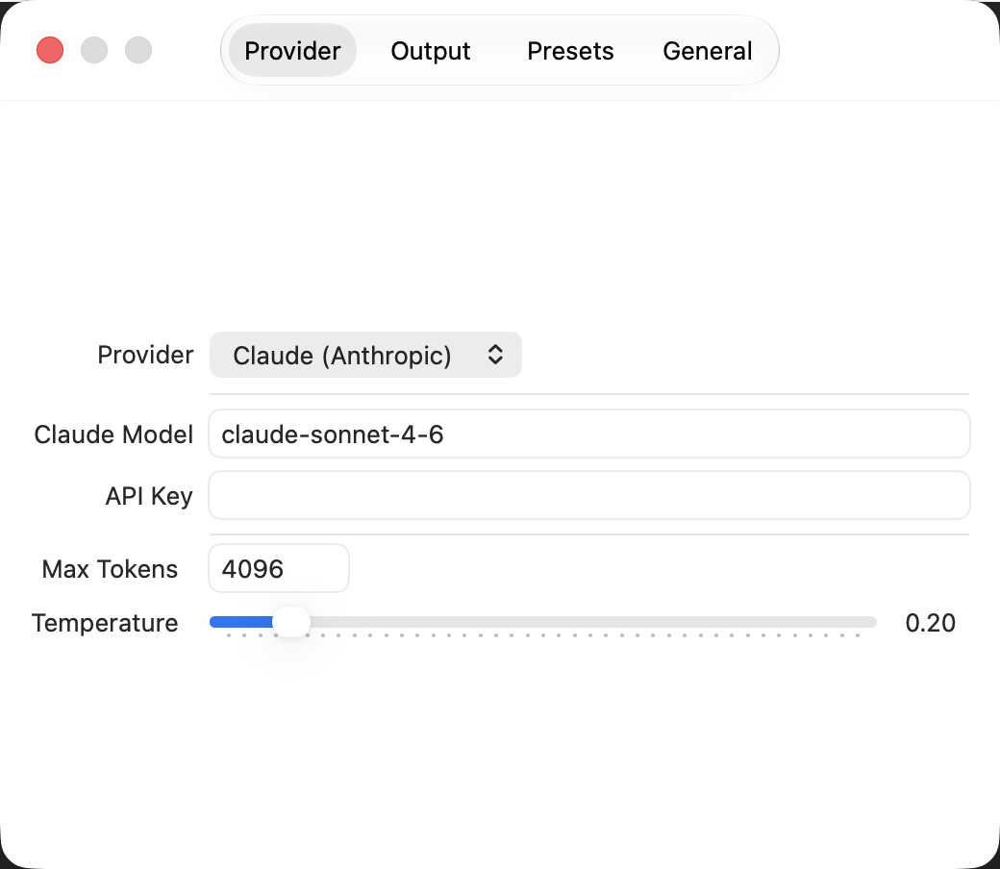

<div align="center">
  

  <h1>CodeWhisper</h1>
</div>

[🇩🇪 Deutsche Version](README.de.md)

**macOS AI code assistant integrated directly into Xcode and any text editor via System Services.**

Select code, right-click → Services → CodeWhisper: Explain. That's it.

[](https://github.com/9t29zhmwdh-coder/CodeWhisper/actions) [](https://github.com/9t29zhmwdh-coder/CodeWhisper/security/code-scanning) [](https://securityscorecards.dev/viewer/?uri=github.com/9t29zhmwdh-coder/CodeWhisper)
      

> **How it runs:** CodeWhisper is a native menu-bar app with no Dock icon and no separate background daemon; it lives entirely in the status bar and the macOS Services menu while running.



---

> 💾 **Download:** [macOS (DMG)](https://github.com/9t29zhmwdh-coder/CodeWhisper/releases/latest/download/CodeWhisper.dmg): always the latest release, not code-signed/notarized (Gatekeeper will show a warning on first run, right-click → Open). Or build from source, see Build & Install below.

---

CodeWhisper's UI is available in English (default) and German, following your system language automatically; override it anytime in Settings → General.

**In practice:** you select any code in any macOS app (Xcode, VS Code, a text editor, even a browser text field), right-click, choose one of CodeWhisper's actions from the Services submenu (Explain, Refactor, Optimize, Add Comments, Find Bugs, Write Tests, or a Custom prompt you define), and CodeWhisper sends that selection to whichever AI provider you configured in Settings (a cloud model like Claude, or a local model via Ollama/llama.cpp if you want nothing leaving your machine). The response then shows up the way you configured it: a floating popup window, copied to your clipboard, a macOS notification, or pasted directly back over your original selection.

---

> 🌱 New here? → [Step-by-step guide for beginners](GETTING_STARTED.md)

---

## Features

| Preset | What it does |
|---|---|
| **Explain** | Plain-English explanation of selected code |
| **Refactor** | Improves readability and best practices |
| **Optimize** | Performance-focused rewrite |
| **Add Comments** | Inserts documentation comments |
| **Find Bugs** | Analyses for bugs and edge cases |
| **Write Tests** | Generates XCTest unit tests |
| **Custom** | Your own system prompt from Settings |

### AI Providers

| Provider | Notes |
|---|---|
| Ollama | local, privacy-first, configurable host/port |
| llama.cpp | local, configurable host/port |
| Claude (Anthropic) | cloud, configurable API key |
| OpenAI | cloud, configurable API key |
| Mistral | cloud, configurable API key |

### Output Modes

- **Popup Window**: floating panel with Copy and Paste Back buttons
- **Copy to Clipboard**: silent, plus a brief notification
- **macOS Notification**: Notification Center
- **Paste Back**: replaces the selected text in the editor (requires Accessibility permission)

---

## Requirements

- macOS 14 Sonoma or later
- Xcode Command Line Tools (`xcode-select --install`)
- Swift 5.9+

---

## Build & Install

```bash
git clone https://github.com/9t29zhmwdh-coder/CodeWhisper
cd CodeWhisper
make install
```

`make install` compiles, assembles the `.app` bundle, copies it to `/Applications/`, and flushes the NSServices cache.

---

## First Launch

1. Open `/Applications/CodeWhisper.app`; a `</>` icon appears in the menu bar.
2. Click it → **Settings** → choose your provider and enter the API key.
3. Restart the menu bar app once (Quit → reopen) to activate the Services entries.
4. In Xcode (or any editor): select code → right-click → **Services** → **CodeWhisper: Explain**.

> **Paste Back** requires *Accessibility* permission:  
> System Settings → Privacy & Security → Accessibility → enable CodeWhisper.

---

## Uninstall / Cleanup

- Delete `/Applications/CodeWhisper.app`
- Remove stored settings: `defaults delete com.9t29zhmwdh.CodeWhisper`
- Remove stored API keys from Keychain Access.app (search for "claudeAPIKey", "openAIAPIKey", "mistralAPIKey")
- Quit CodeWhisper first (or restart) so the NSServices entries disappear from the right-click Services menu

No other files or background services are left behind.

---

## Architecture

```
Sources/CodeWhisper/
├── LLM/               # Provider protocol + Ollama / llama.cpp / any OpenAI-compatible API
├── PromptEngine/      # Presets and prompt builder
├── ResponseFormatter/ # Markdown trim, code block extraction
├── OutputEngine/      # Popup, clipboard, notification, paste-back
├── Settings/          # Keychain, model, UserDefaults persistence
├── Localization/      # L10n: EN/DE strings, system-language detection + manual override
├── UI/                # NSPanel popup, status bar menu
├── AppDelegate.swift  # 7 NSServices selectors → shared pipeline
└── main.swift         # .accessory activation policy
```

---

## Project Structure

```
CodeWhisper/
├── Package.swift
├── Info.plist         # NSServices registration (7 entries), LSUIElement = true
├── Makefile           # build / bundle / install / clean
└── Sources/CodeWhisper/
```

---

**Author:** [Rafael Yilmaz](https://github.com/9t29zhmwdh-coder) · **Status:** Active ·  · **License:** MIT
